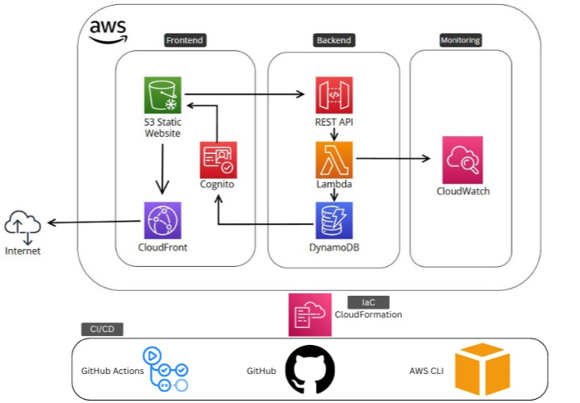

# [VIEW IT HERE](https://alisamalkhalil.online) *(Test view counter at the bottom of the screen by refreshing the page.)*

# My Cloud CV Challenge

## Introduction / Overview

This project is a dynamic online CV hosted on AWS. It uses a serverless architecture to ensure scalability, security, and real-time updates. The frontend, built with HTML and JavaScript, is hosted on **Amazon S3** and distributed globally via **CloudFront** for fast loading and enhanced security (HTTPS and DDoS protection). The backend leverages **AWS Lambda**, **API Gateway**, and **DynamoDB** to power a live visitor counter, which updates dynamically with each page load. **Amazon Cognito** is used for secure user authentication and authorization.

---

## Table of Contents

1. [System Architecture](#system-architecture)
2. [How It Works](#how-it-works)
   - [Frontend](#frontend)
   - [API Gateway](#api-gateway)
   - [Lambda](#lambda)
   - [DynamoDB](#dynamodb)
   - [Cognito](#cognito)
3. [TO DO](#to-do)

---

## System Architecture

The architecture consists of the following key components:

- **Amazon S3**: Hosts the static frontend of the website.
- **CloudFront**: Reduces load time and enhances security with HTTPS and DDoS protection.
- **API Gateway**: Handles incoming HTTP requests, routes them to Lambda functions, and returns the response to the client.
- **AWS Lambda**: Executes business logic triggered by API Gateway requests, interacting with DynamoDB for data storage and retrieval.
- **Amazon DynamoDB**: A NoSQL database that stores application data such as user profiles and session data.
- **Amazon Cognito**: Provides user authentication and authorisation, ensuring secure access to the application.

---

## How It Works

### Frontend

1. **User Interaction**: A user triggers an HTTP request by refreshing the page or taking any action that requires interaction with the backend.
2. **API Request**: The frontend sends an HTTP request to the **API Gateway** with the necessary parameters.

### API Gateway

1. **Request Handling**: The **API Gateway** receives the request from the frontend and forwards it to the corresponding **Lambda** function for processing.

### Lambda

1. **Backend Processing**: After authentication, **Lambda** is triggered to execute, which queries the current view count from **DynamoDB** .
2. **Data Handling**: Lambda increases the view count by 1 and updates in the database.

### DynamoDB

1. **Data Storage**: **DynamoDB** stores the viewcount in a table.
2. **Read/Write Operations**: Each page refresh or API request will trigger an update to DynamoDB.

### Cognito

1. **User Authentication**: A guest user on cognito with permissions to only query the view count on DynamoDB is used to access the database through the Javascript file and to update the view count on the html website.
---

## TO DO

- **Automate Deployment**:  
  - Create a **CloudFormation** template to automate the provisioning of AWS resources (S3, CloudFront, API Gateway, Lambda, DynamoDB, etc.).  
  - Ensure the template is modular and reusable for future updates.

- **Implement CI/CD Pipeline**:  
  - Set up **GitHub Actions** to automate deployments whenever changes are pushed to the repository.  
  - Configure the pipeline to:  
    - Build and deploy the frontend to the **S3 Bucket**.  
    - Update the **CloudFront distribution** to invalidate the cache.  
    - Deploy backend changes (e.g., Lambda functions, API Gateway configurations).  

- **Document the Pipeline**:  
  - Add clear instructions to the `README.md` for setting up and using the CI/CD pipeline.  
  - Include troubleshooting tips and best practices.

- **Testing and Validation**:  
  - Test the entire pipeline end-to-end to ensure seamless deployments.  
  - Validate that the **view counter** and other dynamic features work as expected after each deployment.